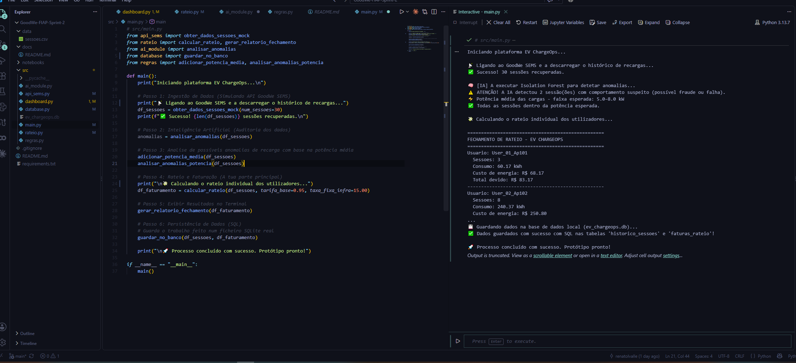

# EV ChargeOps

Protótipo em Python para organizar sessões de recarga compartilhada, calcular o rateio por usuário e apoiar a análise operacional de carregadores elétricos. Desenvolvido para o Enterprise Challenge FIAP, Sprint 2.

## Funcionalidades

- Gera dados simulados de sessões de recarga no adaptador SEMS.
- Calcula o custo por usuário com tarifa variável por horário e taxa fixa de infraestrutura.
- Sinaliza sessões atípicas usando Isolation Forest.
- Armazena sessões e faturas em um banco SQLite local.
- Exibe as faturas e o consumo em um painel Streamlit.

> A conexão com o GoodWe SEMS ainda é simulada: o protótipo não consulta o portal nem requer credenciais. As sessões são geradas para demonstração; valores e alertas não devem ser usados para cobrança real.

## Requisitos

- Python 3.11 ou superior
- Dependências de `requirements.txt`

## Executar

No PowerShell, a partir da pasta do projeto:

```powershell
python -m venv .venv
.\.venv\Scripts\Activate.ps1
python -m pip install -r requirements.txt
python src/main.py
```

O comando principal gera sessões simuladas, calcula o rateio e grava `ev_chargeops.db` na pasta atual. O banco é local e não é versionado.

Para abrir o painel após gerar o banco, execute:

```powershell
streamlit run src/dashboard.py
```

## Estrutura

- `src/`: geração de sessões, análise, rateio, persistência e painel.
- `data/`: dados de exemplo.
- `notebooks/`: exploração interativa das sessões.
- `docs/README.md`: relatório extenso de contexto e arquitetura do desafio.


## Print da execução


O notebook de exploração está em [`notebooks/01_exploracao_sessoes.ipynb`](notebooks/01_exploracao_sessoes.ipynb).